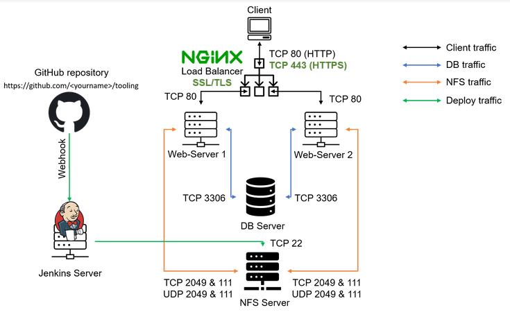
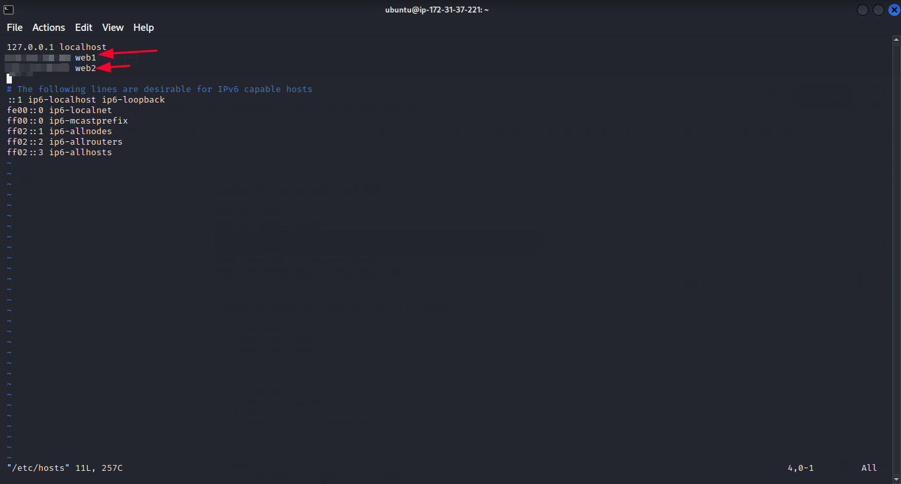

# LOAD-BALANCER-SOLUTION-WITH-NGINX-AND-SSL-TLS
In this project we will configure an Nginx Load Balancer solution and also ensure a secured connection using SSL/TLS. The Architecture will look like this:
 
  
 

### Task
This project consists of two parts:
1. Configure Nginx as a Load Balancer
2. Register a new domain name and configure secured connection using SSL/TLS certificates

## CONFIGURE NGINX AS A LOAD BALANCER
* Create an EC2 VM based on Ubuntu Server 20.04 LTS and name it Nginx LB (do not forget to open TCP port 80 for HTTP connections, also open TCP port 443 – this port is used for secured HTTPS connections).

 
 

* Update /etc/hosts file for local DNS with Web Servers’ names (e.g. Web1 and Web2) and their local IP addresses.

   `sudo vi /etc/hosts`

   

* Install and configure Nginx as a load balancer to point traffic to the resolvable DNS names of the webservers.

      sudo apt update
      sudo apt install nginx

  

* Configure Nginx LB using Web Servers’ names defined in /etc/hosts.

Configure Nginx LB using Web Servers’ names defined in /etc/hosts. Open the default nginx configuration file
`sudo vi /etc/nginx/nginx.conf`

  )

* Restart Nginx and make sure the service is up and running.

      sudo systemctl restart nginx
      sudo systemctl status nginx
  

